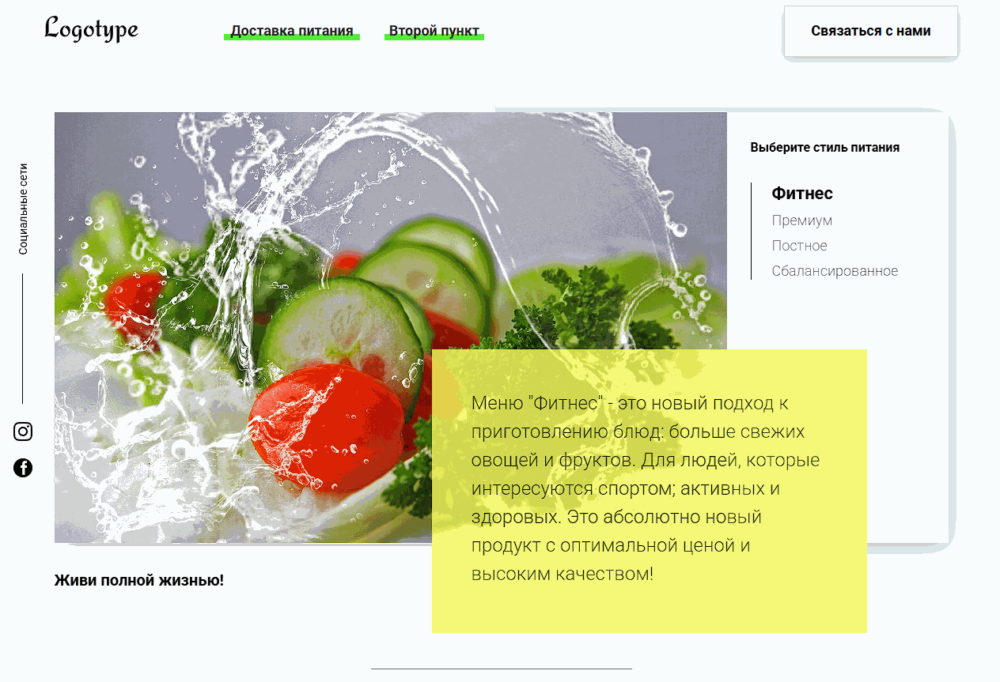
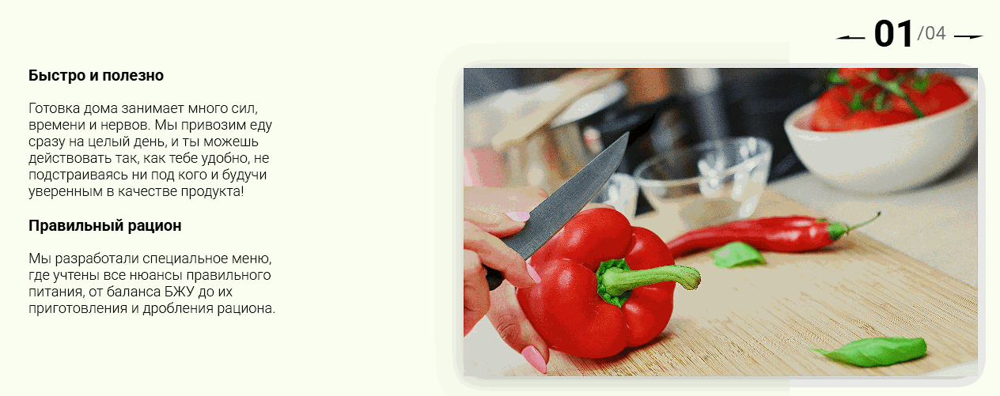
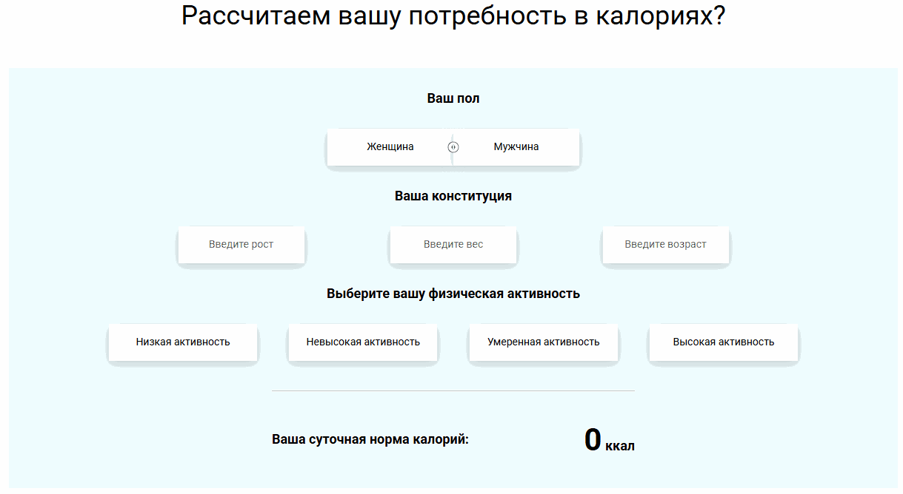
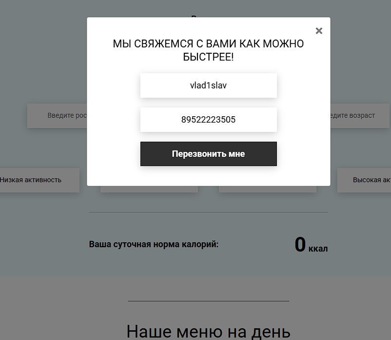
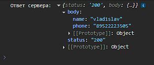

# Foods — проект с интерактивной JS-логикой
Этот проект представляет собой веб-приложение для доставки здорового питания, в котором реализованы различные интерактивные элементы на чистом JavaScript. Проект создан для демонстрации работы с табами, слайдерами, калькуляторами, таймерами, модальными окнами и формами.

## Работа с табами
* Позволяет переключаться между разными стилями питания (Фитнес, Премиум, Постное, Сбалансированное).
* При выборе пункта меняется изображение и описание.

## Слайдер изображений
Интерактивный слайдер с кнопками "вперёд" и "назад", отображающий текущий и общий номер слайда.

## Калькулятор калорий
Позволяет рассчитать суточную норму калорий на основе:
* Пола
* Роста, веса, возраста
* Уровня физической активности
* Результат обновляется в реальном времени при изменении параметров.

## Таймер обратного отсчёта
* Отсчитывает время до конца акции (25 декабря).
* Обновляется каждую секунду.

## Модальные окна и формы
* Модальное окно открывается при клике на кнопки "Связаться с нами" или автоматически через 2 секунды после загрузки страницы.
* Формы валидируются (имя и телефон).

* Данные отправляются на сервер (имитация) и выводятся в консоль.

## Технологии
* HTML5 — семантическая вёрстка
* CSS3 — стилизация, адаптивность
* Vanilla JavaScript — вся интерактивность без библиотек
* Fetch API — отправка данных формы